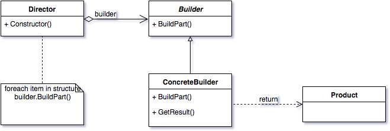

# 建造者模式（Builder Pattern）

## 定义
将一个复杂的对象的构建与它的表示分离，使得同样的构建过程可以创建不同的表示

## 类图

* **Builder** 抽象建造者，以规范产品对象的各个组成部分的建造。这个接口规定要实现复杂对象的哪些部分的创建，并不涉及具体的对象部件的创建。
* **ConcreteBuilder** 具体建造者类，针对不同的业务，具体化复杂对象的各部分的创建。在建造过程完成后，提供产品的实例。
* **Director** 导演类，调用具体建造者来创建复杂对象的各个部分，不涉及具体产品的信息，只负责保证对象各部分完整创建或按某种顺序创建。
* **Product** 要创建的复杂对象

## 现实场景
1. 某些地方的楼歪歪事件，官方的解释就是由于先建立楼房后，再建设停车场造成的，典型的建造次序错乱。
2. 某地方各家餐馆相同的菜，味道却不同，因为做法未形成标准，烹调步骤不一，反之，全世界每家KFC餐厅的巨无霸汉堡都是一个味道，因为KFC内部有严格的规定，必须遵守统一的生产加工流程。

## 应用场景
1. 创建一些复杂的对象时，这些对象的内部组成构件间的建造顺序是稳定的，但是对象的内部组成构件面临着复杂的变化
2. 要创建的复杂对象的算法，独立于该对象的组成部分，也独立于组成部分的装配方法时

## 使用它的好处
1. 可以使客户端不必知道产品内部组成的细节
2. 具体的建造者类之间是相互独立的，对系统的扩展有利
3. 可以对建造过程逐步细化，而不对其他的模块产生任何影响

## 特点
1. 建造者模式注重零部件的组装过程，并不关注零部件的创建过程

## 参考
[设计模式之建造者模式（Builder）](http://www.cnblogs.com/BeyondAnyTime/archive/2012/07/19/2599980.html)
