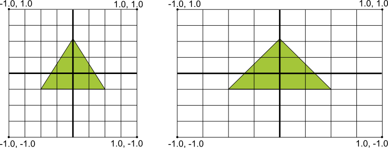
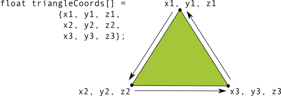

# [OpenGL ES](https://developer.android.google.cn/guide/topics/graphics/opengl.html) #

* OpenGL ES 1.0 and 1.1 - Android 1.0版本开始支持
* OpenGL ES 2.0 - Android 2.2（API level 8）版本开始支持
* OpenGL ES 3.0 - Android 4.3（API level 18）版本开始支持
* OpenGL ES 3.1 - Android 5.0（API level 21）版本开始支持

> 警告：设备制造商需要提供图形管线编程的实现，才能在设备上支持OpenGL ES 3.0的接口。一个运行Android 4.3或者更高版本的设备也可能不支持OpenGL ES 3.0的接口。如果想要在运行时，获取当前能支持的OpenGL ES版本，可以参考**Checking OpenGL ES Version**

> 注意：Android框架中支持的OpenGL ES接口与J2ME JSR239上的十分相似，但并不完全相同。如果你十分熟悉J2ME JSR239上的接口，一定要特别注意两者之间的差别。

## The Basics ##
Android同时在起SDK和NDK中支持OpenGL。此篇文章更关注SDK中提供的接口。如果想获得更多有关NDK的信息，参见[Android NDK](https://developer.android.google.cn/ndk/index.html)
在Android SDK中有两个基础类，让你可以使用OpenGL ES的接口来创建和处理图像——[GLSurfaceView](https://developer.android.google.cn/reference/android/opengl/GLSurfaceView.html)和[GLSurfaceView.Renderer](https://developer.android.google.cn/reference/android/opengl/GLSurfaceView.Renderer.html)。如果你的目标是在你的应用程序中使用OpenGL，你需要做的第一件事，就是明白如何在一个activity中实现这两个类。

[GLSurfaceView](https://developer.android.google.cn/reference/android/opengl/GLSurfaceView.html)

* 这个类是一个View，你可以使用OpenGL的接口来绘制和处理很多对象，其在使用上和[SurfaceView](https://developer.android.google.cn/reference/android/view/SurfaceView.html)基本一致。你可以通过创建一个[GLSurfaceView](https://developer.android.google.cn/reference/android/opengl/GLSurfaceView.html)的实例并为其添加自定义[Renderer](https://developer.android.google.cn/reference/android/opengl/GLSurfaceView.Renderer.html)的方式使用[GLSurfaceView](https://developer.android.google.cn/reference/android/opengl/GLSurfaceView.html)这个类。然而如果你想要获取触屏事件，你应该通过继承[GLSurfaceView](https://developer.android.google.cn/reference/android/opengl/GLSurfaceView.html)类，实现其触摸事件监听器的方式来获取。就像OpenGL分享课程中讲的那样，[响应触摸事件](https://developer.android.google.cn/training/graphics/opengl/touch.html)。

[GLSurfaceView.Renderer](https://developer.android.google.cn/reference/android/opengl/GLSurfaceView.Renderer.html)

* 这个接口定义了使用[GLSurfaceView](https://developer.android.google.cn/reference/android/opengl/GLSurfaceView.html)绘制图像需要实现的方法。你必须定义一个单独的实现类，并且使用[GLSurfaceView.setRenderer()](https://developer.android.google.cn/reference/android/opengl/GLSurfaceView.html#setRenderer(android.opengl.GLSurfaceView.Renderer))方法将其添加到你的[GLSurfaceView](https://developer.android.google.cn/reference/android/opengl/GLSurfaceView.html)的实例对象中。

* [GLSurfaceView.Renderer](https://developer.android.google.cn/reference/android/opengl/GLSurfaceView.Renderer.html)需要你实现以下方法：
    * [onSurfaceCreated()](https://developer.android.google.cn/reference/android/opengl/GLSurfaceView.Renderer.html#onSurfaceCreated(javax.microedition.khronos.opengles.GL10,%20javax.microedition.khronos.egl.EGLConfig))：系统会在创建GLSurfaceView实例时，调用此方法一次。在此方法中去执行那些只需要执行一次的操作，比如设置OpenGL环境变量或初始化OpenGL图形对象。
    * [onDrawFrame()](https://developer.android.google.cn/reference/android/opengl/GLSurfaceView.Renderer.html#onDrawFrame(javax.microedition.khronos.opengles.GL10))：系统会在每次绘制GLSurfaceView时调用此方法。
    * [onSurfaceChanged()](https://developer.android.google.cn/reference/android/opengl/GLSurfaceView.Renderer.html#onSurfaceChanged(javax.microedition.khronos.opengles.GL10,%20int,%20int))：系统会在GLSurfaceView的结构发生变化时调用此方法，如大小发生变化或设备屏幕的方向发生变化时。

### OpenGL ES packages ###
如果你已经使用GLSurfaceView和GLSurfaceView.Renderer建立了一个绘制OpenGL ES的容器，你可以使用下面的这些类来调用OpenGL的接口了：

* OpenGL ES 1.0/1.1 API Packages
    * [android.opengl](https://developer.android.google.cn/reference/android/opengl/package-summary.html) - 这个包提供了OpenGL ES 1.0/1.1相关类的静态接口，比`javax.microedition.khronos`中的接口更高效。
        * [GLES10](https://developer.android.google.cn/reference/android/opengl/GLES10.html)
        * [GLES10Ext](https://developer.android.google.cn/reference/android/opengl/GLES10Ext.html)
        * [GLES11](https://developer.android.google.cn/reference/android/opengl/GLES11.html)
        * [GLES11Ext](https://developer.android.google.cn/reference/android/opengl/GLES11Ext.html)
    * [javax.microedition.khronos.opengles](https://developer.android.google.cn/reference/javax/microedition/khronos/opengles/package-summary.html) - 这个包提供了OpenGL ES 1.0/1.1接口的标准实现
        * [GL10](https://developer.android.google.cn/reference/javax/microedition/khronos/opengles/GL10.html)
        * [GL10Ext](https://developer.android.google.cn/reference/javax/microedition/khronos/opengles/GL10Ext.html)
        * [GL11](https://developer.android.google.cn/reference/javax/microedition/khronos/opengles/GL11.html)
        * [GL11Ext](https://developer.android.google.cn/reference/javax/microedition/khronos/opengles/GL11Ext.html)
        * [GL11ExtensionPack](https://developer.android.google.cn/reference/javax/microedition/khronos/opengles/GL11ExtensionPack.html)

* OpenGL ES 2.0 API Class
    * [android.opengl.GLES20](https://developer.android.google.cn/reference/android/opengl/GLES20.html) - 这个包提供了OpenGL ES 2.0的接口，并且是从Android 2.2(API level 8)开始有效的

* OpenGL ES 3.0/3.1 API Packages
    * [android.opengl](https://developer.android.google.cn/reference/android/opengl/package-summary.html) - 这个包提供了所有OpenGL ES 3.0/3.1的接口类，3.0版本从Android 4.3 (API level 18)开放，3.1版本是从Android 5.0 (API level 21)开始开放的。
        * [GLES30](https://developer.android.google.cn/reference/android/opengl/GLES30.html)
        * [GLES31](https://developer.android.google.cn/reference/android/opengl/GLES31.html)
        * [GLES31Ext](https://developer.android.google.cn/reference/android/opengl/GLES31Ext.html)（[Android Extension Pack](https://developer.android.google.cn/guide/topics/graphics/opengl.html#aep)）

如果你想立刻使用OpenGL ES创建一个应用，参见[Displaying Graphics with OpenGL ES](https://developer.android.google.cn/training/graphics/opengl/index.html)。

## Declaring OpenGL Requirements ##
如果你的应用程序使用的OpenGL的特性在所有的设备上均无效，你必须将以下的依赖放到你的[AndroidManifest.xml](https://developer.android.google.cn/guide/topics/manifest/manifest-intro.html)文件中。这些是最常见的OpenGL声明：

* **OpenGL ES版本依赖** - 如果你的应用程序要使用一个指定版本的OpenGL ES，你必须将下面的设置项在你的清单文件当中进行声明：

    指定OpenGL ES 2.0：
    ``` xml
    <!-- Tell the system this app requires OpenGL ES 2.0. -->
    <uses-feature android:glEsVersion="0x00020000" android:required="true" />
    ```
    添加这条声明会让Google Play限制你的应用安装在不支持OpenGL ES 2.0的设备上。如果你的应用仅仅是针对那些支持OpenGL ES 3.0的设备开发的，你也可以在你的清单文件中指定如下：

    指定OpenGL ES 3.0：
    ``` xml
    <!-- Tell the system this app requires OpenGL ES 3.0. -->
    <uses-feature android:glEsVersion="0x00030000" android:required="true" />
    ```

    指定OpenGL ES 3.1：
    ``` xml
    <!-- Tell the system this app requires OpenGL ES 3.1. -->
    <uses-feature android:glEsVersion="0x00030001" android:required="true" />
    ```
    > 注意：OpenGL ES 3.x的接口是向下兼容2.0的，这意味着你可以在你的应用中更灵活的使用OpenGL ES。通过在清单文件中声明OpenGL ES 2.0是必要条件，你可以让这个API版本成为默认的版本，同时可以在运行时检查是否支持3.+版本，如果当前设备支持，可以使用OpenGL ES 3.+的特性。如果想要了解更多有关检查设备支持的OpenGL ES的版本的信息，可以看一下[Checking OpenGL ES Version](https://developer.android.google.cn/guide/topics/graphics/opengl.html#version-check)。

* **纹理压缩依赖** - 如果你的应用使用了纹理压缩格式，你必须在你的清单文件中使用标签[<supports-gl-texture>](https://developer.android.google.cn/guide/topics/manifest/supports-gl-texture-element.html)来声明你的应用支持的格式。想要了解更多关于有效的纹理压缩格式的信息，可以看一下[Texture compression support](https://developer.android.google.cn/guide/topics/graphics/opengl.html#textures)。

如果用户的设备不支持某一种你在应用清单文件中声明的纹理压缩类型，你的应用对用户将是不可见的。想要了解更多有关Google Play过滤纹理压缩相关的信息，可以去看`<supports-gl-texture>`这篇文章中的[Google Play and texture compressing filtering](https://developer.android.google.cn/guide/topics/manifest/supports-gl-texture-element.html#market-texture-filtering)部分的讲解。

## Mapping Coordinates for Drawn Objects ##
在Android设备中显示图像的一个最基本的问题是屏幕在大小和形状上有很大的差异性。OpenGL假定了一个正方形且均匀的坐标系，默认将这些坐标点绘制在你的非正方形的物理屏幕上，就与在一个完美的正方形屏幕上一样。


提示：默认的OpenGL坐标系的左侧对应的是一个典型物理Android设备的屏幕上的右侧。

上面插图中的左图展示了假定一个OpenGL图层在均匀坐标系中的效果，而右图是这些坐标点显示在一个典型的横向放置的设备屏幕上的效果。为了解决这个问题，你可以应用OpenGL的投影模式和摄影视图来转换坐标点，这样你的图形对象就可以在任何设备上显示正确的比例。

为了应用投影模式和摄影视图，你需要创建一个投影矩阵，一个摄影视图矩阵，并将它们应用到OpenGL的渲染管线中。投影矩阵会重新计算你的图形的坐标，让他们能够正确的显示在Android设备的屏幕上。摄影视图矩阵从指定的摄像位置创建了一个对象的转换。

### Projection and carmera in ES 1.0 ###
在1.0版本的API中，你需要通过创建投影矩阵和摄影矩阵，并将它们添加到OpenGL环境中来应用它们。

1. **投影矩阵** - 为了重新计算对象的坐标，将它们画在屏幕的正确位置上，需要根据设备屏幕的几何特性来创建一个投影矩阵。下面的示例代码展示了如何通过重写[GLSurfaceView.Renderer](https://developer.android.google.cn/reference/android/opengl/GLSurfaceView.Renderer.html)实现类的[onSurfaceChanged](https://developer.android.google.cn/reference/android/opengl/GLSurfaceView.Renderer.html#onSurfaceChanged(javax.microedition.khronos.opengles.GL10,%20int,%20int))方法的方式根据屏幕的显示比例来创建一个投影矩阵，并将其应用到OpenGL渲染环境当中。
    ```java
    public void onSurfaceChanged(GL10 gl, int width, int height) {
        gl.glViewport(0, 0, width, height);

        // make adjustments for screen ratio
        float ratio = (float) width / height;
        gl.glMatrixMode(GL10.GL_PROJECTION);        // set matrix to projection mode
        gl.glLoadIdentity();                        // reset the matrix to its default state
        gl.glFrustumf(-ratio, ratio, -1, 1, 3, 7);  // apply the projection matrix
    }
    ```

2. **摄像变换矩阵** - 一旦你使用了投影矩阵调整了坐标系，你还需要施加一个摄影视图。下面例子中的代码展示了如何通过重写[GLSurfaceView.Renderer](https://developer.android.google.cn/reference/android/opengl/GLSurfaceView.Renderer.html)实现类的[onDrawFrame](https://developer.android.google.cn/reference/android/opengl/GLSurfaceView.Renderer.html#onDrawFrame(javax.microedition.khronos.opengles.GL10))方法的方式来施加一个模型视图，以及使用[GLU.gluLookAt()](https://developer.android.google.cn/reference/android/opengl/GLU.html#gluLookAt(javax.microedition.khronos.opengles.GL10,%20float,%20float,%20float,%20float,%20float,%20float,%20float,%20float,%20float))工具来实现模拟摄像机观察位置变化。
    ```java
    public void onDrawFrame(GL10 gl) {
        ...
        // Set GL_MODELVIEW transformation mode
        gl.glMatrixMode(GL10.GL_MODELVIEW);
        gl.glLoadIdentity();                      // reset the matrix to its default state

        // When using GL_MODELVIEW, you must set the camera view
        GLU.gluLookAt(gl, 0, 0, -5, 0f, 0f, 0f, 0f, 1.0f, 0.0f);
        ...
    }
    ```

### Projection and carmera in ES 2.0 and higher ###
在2.0以及3.0的API中，你通过先添加一个矩阵成员变量到你需要绘制的图形对象的顶点着色器的方式来使用投影及摄影视图。在将矩阵成员添加之后，你可以生成并应用投影和摄影视图模型到你的对象当中。

1. **添加矩阵到顶点着色器** - 创建一个视图投影矩阵的变量，并将其与着色器的点相乘。在下面顶点着色器代码的例子中，其`uMVPMatrix`成员允许你将投影以及摄影视图矩阵设置到使用这个着色器的对象的坐标中。
    ```java
    private final String vertexShaderCode =

        // This matrix member variable provides a hook to manipulate
        // the coordinates of objects that use this vertex shader.
        "uniform mat4 uMVPMatrix;   \n" +

        "attribute vec4 vPosition;  \n" +
        "void main(){               \n" +
        // The matrix must be included as part of gl_Position
        // Note that the uMVPMatrix factor *must be first* in order
        // for the matrix multiplication product to be correct.
        " gl_Position = uMVPMatrix * vPosition; \n" +

        "}  \n";
    ```
    > 注意：上面的示例代码在一个结合投影矩阵和摄影视图矩阵的顶点着色器中定义了一个单独变换的矩阵成员。根据你的应用的需求，你也许想要在顶点着色器中将投影矩阵和摄影视图矩阵分开，所以你也可以将它们单独定义。
2. **获取着色器中的矩阵成员** - 通过创建一个钩子到你的顶点着色器中请求投影和摄影视图，你可以通过使用这个变量来请求投影和摄像机观察矩阵。下面的代码展示了如何重写[GLSurfaceView.Renderer](https://developer.android.google.cn/reference/android/opengl/GLSurfaceView.Renderer.html)实现类的[onSurfaceCreated](https://developer.android.google.cn/reference/android/opengl/GLSurfaceView.Renderer.html#onSurfaceCreated(javax.microedition.khronos.opengles.GL10,%20javax.microedition.khronos.egl.EGLConfig))的方法来使用在顶点着色器中定义的矩阵变量。
    ```java
    public void onSurfaceCreated(GL10 unused, EGLConfig config) {
        ...
        muMVPMatrixHandle = GLES20.glGetUniformLocation(mProgram, "uMVPMatrix");
        ...
    }
    ```
3. **创建投影和摄影观察矩阵** - 生成投影和观察矩阵需要使用图形对象。下面的示例代码展示了如何通过重写[GLSurfaceView.Renderer](https://developer.android.google.cn/reference/android/opengl/GLSurfaceView.Renderer.html)实现类的[onSurfaceCreated](https://developer.android.google.cn/reference/android/opengl/GLSurfaceView.Renderer.html#onSurfaceCreated(javax.microedition.khronos.opengles.GL10,%20javax.microedition.khronos.egl.EGLConfig))和[onSurfaceCreated](https://developer.android.google.cn/reference/android/opengl/GLSurfaceView.Renderer.html#onSurfaceCreated(javax.microedition.khronos.opengles.GL10,%20int,%20int))两个方法根据设备屏幕的显示比例来创建摄影视图矩阵和一个投影矩阵。
    ```java
    public void onSurfaceCreated(GL10 unused, EGLConfig config) {
        ...
        // Create a camera view matrix
        Matrix.setLookAtM(mVMatrix, 0, 0, 0, -3, 0f, 0f, 0f, 0f, 1.0f, 0.0f);
    }

    public void onSurfaceChanged(GL10 unused, int width, int height) {
        GLES20.glViewport(0, 0, width, height);

        float ratio = (float) width / height;

        // create a projection matrix from device screen geometry
        Matrix.frustumM(mProjMatrix, 0, -ratio, ratio, -1, 1, 3, 7);
    }
    ```
4. **请求投影和摄影观察矩阵** - 想要请求投影并让摄像机显示变化，让两个矩阵相乘然后将它们设置到顶点着色器中。下面例子中的代码展示了如何通过重写[GLSurfaceView.Renderer](https://developer.android.google.cn/reference/android/opengl/GLSurfaceView.Renderer.html)实现类的[onDrawFrame](https://developer.android.google.cn/reference/android/opengl/GLSurfaceView.Renderer.html#onDrawFrame(javax.microedition.khronos.opengles.GL10))方法的方式将代码中创建的投影矩阵和摄影视图结合起来，并将其施加到通过OpenGL渲染的图形对象上。
    ```java
    public void onDrawFrame(GL10 unused) {
        ...
        // Combine the projection and camera view matrices
        Matrix.multiplyMM(mMVPMatrix, 0, mProjMatrix, 0, mVMatrix, 0);

        // Apply the combined projection and camera view transformations
        GLES20.glUniformMatrix4fv(muMVPMatrixHandle, 1, false, mMVPMatrix, 0);

        // Draw objects
        ...
    }
    ```
一个已完成的例子，显示了如何通过OpenGL ES 2.0请求投影和摄影视图，见课程[Displaying Graphics with OpenGL ES](https://developer.android.google.cn/training/graphics/opengl/index.html)

## Shape Faces and Winding ##
在OpenGL中，一个图形的外观是通过三维空间中的三个或者更多的点定义的。一个包含三个或者更多三维空间点（在OpenGL中称为顶点）的集合拥有前后两面。你怎么样才能知道哪一面是前面哪一面是后面呢？这是一个好问题，答案就在你定义图像的顶点时方向或者曲线中。


说明：插图中是转换成逆时针的绘制顺序的坐标集合

在这个例子中，三角形的顶点被定义成使用逆时针的顺序绘制。坐标点的绘制顺序被定义成环绕绕图形的方向。在OpenGL中，默认将按照逆时针绘制的面是（被OpenGL解释成）正面。所以你在图一中看到的是三角形的正面，而另一边就是三角形的背面。

为什么知道哪一面是图形的正面如此重要呢？答案是OpenGL中的一个通常的特性，叫做剔除面。剔除面在OpenGL的环境中是一种选项，允许渲染管线忽略（不计算或者不绘制）一个图形的背面，节省时间、内存已经处理周期：
```java
// enable face culling feature
gl.glEnable(GL10.GL_CULL_FACE);
// specify which faces to not draw
gl.glCullFace(GL10.GL_BACK);
```
如果你在不知道哪些边是你所绘制图形的正反面的情况下尝试使用剔除面特性，你的OpenGL图像将会看起来有点窄，或者可能根本就不会显示。所以，一定要坚持使用逆时针的绘制顺序来定义你的OpenGL图像的坐标点。
> 注意：也有可能在OpenGL的环境中将顺时针面视为正面，但是这样将会需要更多的代码，并且在你向有经验的OpenGL开发者寻求帮助时会让他们很迷惑。所以不要这样做。

## OpenGL Versions and Device Compatibility ##
在Android 1.0版本中开始支持OpenGL ES 1.0和1.1标准的API。从Android 2.2版本（API level 8）开始支持OpenGL ES 2.0 API标准。OpenGL ES 2.0被大部分的Android设备所支持，并且在使用OpenGL开发新的应用时被推荐。OpenGL ES 3.0在Android 4.3（API level 18）及更高的版本中被支持，部署在提供了OpenGL ES 3.0 API实现的设备上。想了解某指定OpenGL ES版本在支持Android设备中的占比，可以去看[OpenGL ES Verison](https://developer.android.google.cn/about/dashboards/index.html#OpenGL)。

使用OpenGL ES 1.0/1.1 API与是使用2.0或者更高版本API的图形程序会有非常明显的不同。1.x版本的API拥有很多简化的方法及固定图形管线，OpenGL ES 2.0 and 3.0 API通过着色器对管线提供了更直接的控制。你应该谨慎考虑图像的需求，然后选择一个让你的应用表现最好的API版本。想要了解更多的信息，见[Choosing an OpenGL API Version](https://developer.android.google.cn/guide/topics/graphics/opengl.html#choosing-version)

OpenGL ES的3.0版本的API相对于2.0版本提供了更多的特性和更好的性能，同时向后兼容。这意味着你在使用OpenGL ES 2.0书写应用程序的同时，可以有选择性的使用被支持的OpenGL ES 3.0版本的图形特性。想了解更多有关检测3.0 API可用性的信息，见[Checking OpenGL ES Version](https://developer.android.google.cn/guide/topics/graphics/opengl.html#version-check)

### Texture compression support ###
压缩纹理通过降低内存开销及更高的内存带宽使用率等方面可以显著提高你的OpenGL应用的性能。Android框架将对ETC1压缩格式的支持作为标准特性，包含一个[ETC1Util](https://developer.android.google.cn/reference/android/opengl/ETC1Util.html)工具类及`etc1tool`压缩工具（位于`<sdk>/tools/`目录）。一个使用纹理压缩的应用示例，见Android SDK中的示例代码`CompressedTextureActivity`（`<sdk>/samples/<version>/ApiDemos/src/com/example/android/apis/graphics/`）。
> 当心：ETC1格式在大多数Android设备中是被支持的，但是也不保证一定是有效的。通过使用[ETC1Util.isETC1Supported()](https://developer.android.google.cn/reference/android/opengl/ETC1Util.html#isETC1Supported())方法来检查当前设备是否支持ETC1格式。
> 注意：ETC1纹理压缩格式不支持透明（alpha通道）。如果你的应用要用到透明的纹理，你应该调研一下目标设备支持的其他纹理压缩格式。

ETC2/EAC纹理压缩格式在OpenGL ES 3.0版本中被承诺是一定有效的。这个纹理格式提供了极高的压缩比例、高画质，同时这个格式也支持透明（alpha通道）。

在ETC格式之上，Android设备根据不同的GPU芯片和OpenGL实现支持多种纹理压缩。你应该调研一下设备上支持的纹理压缩，然后决定那种压缩类型是应该被你的应用程序支持的。为了判断某个指定设备支持哪些纹理压缩格式，你需要[查阅设备](https://developer.android.google.cn/guide/topics/graphics/opengl.html#gl-extension-query)并审阅在OpenGL中的扩展名，来辨认设备上支持的纹理压缩格式（或其他OpenGL特性）。下面是一些常见的纹理压缩格式：
* **ATITC(ATC)** - ATI纹理压缩（简称ATITC或ATC）在多种多样的设备上都是有效的，并且对具有alpha通道或者没有的RGB纹理提供固定的压缩率。此格式在OpenGL中具有多个扩展名，如：
    * `GL_AMD_compressed_ATC_texture` 
    * `GL_ATI_texture_compression_atitc`
* **PVRTC** - PowerVR纹理压缩（简称PVRTC）在大量的设备中是有效的，其支持每个像素2比特和4比特的有alpha通道或没有的纹理。此格式在OpenGL中用如下扩展名表示：
    * `GL_IMG_texture_compression_pvrtc`
* **S3TC(DXTn/DXTc)** - S3压缩纹理（S3TC)有多种变体（DXT1到DXT5),其应用范围相对并不广泛。此格式支持具有4位或者8位的alpha通道的RGB纹理。这些格式在OpenGL中可以用如下扩展名表示：
    * `GL_EXT_texture_compression_s3tc`
    某些设备仅支持DXT1格式，这种有限的支持通过下面的扩展名表示：
    * `GL_EXT_texture_compression_dxt1`
* **3DC** - 3DC纹理压缩（简称3DC）也是一种应用范围较少的格式，其支持具有alpha通道的RGB纹理。这个格式使用如下扩展名表示： 
    * `GL_AMD_compressed_3DC_texture`
> 警告：这些压缩纹理格式并不是在所有的设备上都被支持。这些格式的支持因生产者和设备的不同而产生差异。想要了解在指定的设备上如何查明其支持的纹理压缩格式，接着看下一节。

> 注意：一旦你决定了在你的应用程序中要支持哪种格式的压缩纹理，一定要在清单文件中使用[`<supports-gl-texture>`](https://developer.android.google.cn/guide/topics/manifest/supports-gl-texture-element.html)标签进行声明。使用此声明可以被诸如Google Play等外部服务过滤到，这样你的应用就可以被安装到支持你所声明的格式的设备上。要了解更多细节，请看[OpenGL manifest declarations](https://developer.android.google.cn/guide/topics/graphics/opengl.html#manifest)。

### Determining OpenGL extensions ###
随着被支持的OpenGL ES API继续扩展，不同的Android设备之间的实现会有不同。这些扩展中纹理压缩是具有代表性的，在OpenGL的特性集合中也包含了其他的特性。

在指定的设备上查明哪种纹理压缩格式及其他OpenGL的扩展是被支持的。

1. 运行下面的代码到你的目标设备上，来查看哪些纹理压缩格式是被支持的：
    ```java
    String extensions = javax.microedition.khronos.opengles.GL10.glGetString(GL10.GL_EXTENSIONS);
    ```
    > 警告：在不同的设备型号上结果是不同的！你必须运行这段代码到多个指定的设备上，才能知道哪些压缩纹理格式是被普遍支持的。
2. 检查这段代码的输出以查看哪些OpenGL扩展是被支持的。
#### Android Extension Pack(AEP) ####
在OpenGL 3.1版本的规范中，AEP确保你的应用支持一系列已标准化的OpenGL扩展。将这些扩展一起打包并鼓励跨设备时有一贯的功能，同时让开发者充分利用最新的移动GPU设备。

AEP在片元着色器也提高了图像、着色器存储缓冲，原子计算器的支持。

如果你的应用要使用AEP，应用的清单文件中必须声明依赖AEP。此外，平台版本也一定要支持。

在清单文件中，像下面这样声明对AEP的依赖：
```xml
<uses feature android:name="android.hardware.opengles.aep" android:required="true" />
```
使用[hasSystemFeature](https://developer.android.google.cn/reference/android/content/pm/PackageManager.html#hasSystemFeature(java.lang.String))方法并以[FEATURE_OPENGLES_EXTENSION_PACK](https://developer.android.google.cn/reference/android/content/pm/PackageManager.html#FEATURE_OPENGLES_EXTENSION_PACK)作为参数来检验平台版本对AEP的支持，下面的代码片段展示了具体应该怎么做：
```java
boolean deviceSupportsAEP = getPackageManager().hasSystemFeature(PackageManager.FEATURE_OPENGLES_EXTENSION_PACK);
```
如果这个方法返回true，AEP就是被支持的。

了解更多关于AEP的信息，访问此页面[Khronos OpenGL ES Registry](https://www.khronos.org/registry/gles/extensions/ANDROID/ANDROID_extension_pack_es31a.txt)

### Checking OpenGL ES Version ###
在Android设备上，有多个版本的OpenGL ES是有效的。你可以在清单文件中指定你的应用需要的最低的API版本，但同时也许你想使用新版本API中的某些特性。比如，OpenGL 3.0是向后兼容2.0版本的，所以你也许想要在书写程序时使用3.0的某些特性，而当API 3.0不可用时回退到2.0。

在使用某些比清单文件中声明的最低版本高的OpenGL版本特性时，你的应用应该检查这个API版本在设备上的有效性。你可以选择使用下面方式中的一种：
1. 尝试创建高版本OpenGL ES上下文（[EGLContext](https://developer.android.google.cn/reference/android/opengl/EGLContext.html)），并查看结果。
2. 创建一个最低版本OpenGL ES上下文，并查看版本号。

后面的代码示范了如何通过创建一个[EGLContext](https://developer.android.google.cn/reference/android/opengl/EGLContext.html)对象并检查结果的方式检测有效的OpenGL ES版本。这个例子展示了如何检测OpenGL ES 3.0版本：
```java
private static double glVersion = 3.0;

private static class ContextFactory implements GLSurfaceView.EGLContextFactory {

  private static int EGL_CONTEXT_CLIENT_VERSION = 0x3098;

  public EGLContext createContext(
          EGL10 egl, EGLDisplay display, EGLConfig eglConfig) {

      Log.w(TAG, "creating OpenGL ES " + glVersion + " context");
      int[] attrib_list = {EGL_CONTEXT_CLIENT_VERSION, (int) glVersion,
              EGL10.EGL_NONE };
      // attempt to create a OpenGL ES 3.0 context
      EGLContext context = egl.eglCreateContext(
              display, eglConfig, EGL10.EGL_NO_CONTEXT, attrib_list);
      return context; // returns null if 3.0 is not supported;
  }
}
```
如果`createContext()`方法结果返回null，你的代码应该创建OpenGL ES 2.0上下文并只使用这个版本的API。

下面的代码示范了如何通过先创建一个最低版本的上下文检查OpenGL ES版本，并查看版本号：
```java
// Create a minimum supported OpenGL ES context, then check:
String version = javax.microedition.khronos.opengles.GL10.glGetString(GL10.GL_VERSION);
Log.w(TAG, "Version: " + version );
// The version format is displayed as: "OpenGL ES <major>.<minor>"
// followed by optional content provided by the implementation.
```
至此，如果你发现设备支持了高版本的API，你应该销毁最低版本的OpenGL ES上下文，并使用高版本的API创建一个新的上下文。

## Choosing an OpenGL API Version ##
OpenGL ES 1.0版本（及扩展的1.1版本），2.0版本还有3.0版本均提供了高性能的图形接口，以创建三维游戏、可视化及用户界面。OpenGL ES 2.0版本和3.0版本的高度相似，3.0版本相当于2.0版本的额外功能的一个超集。OpenGL ES 1.0/1.1程序接口与2.0和3.0版本有显著的不同，所以开发者们在使用API进行开发之前，应该认真考虑下面几点因素：
* **性能** - 一般来说，OpenGL ES 2.0和3.0版本比1.0/1.1提供了更高的图形性能。然而，性能的差异性在你的程序运行在不同的Android设备上不会有不同，而部分差异发生在硬件厂商对OpenGL ES图形管线的实现上。 
* **设备兼容性** - 开发者应该考量客户的设备类型，Android版本以及有效的OpenGL ES版本。 了解更多关于跨设备的OpenGL兼容性的信息，见[OpenGL Versions and Device Compatibility](https://developer.android.google.cn/guide/topics/graphics/opengl.html#compatibility)节。
* **方便的编码** - OpenGL ES 1.0/1.1 API支持固定管线，及很多在2.0和3.0版本中无效的简易函数。新的OpenGL开发者能够更快和方便的查找1.0/1.1版本的代码。
* **图象控制** - OpenGL ES 2.0 and 3.0 API通过使用着色器提供了完全的可编程管线，以提供高度的控制。通过更直接的控制图像操作管线，开发者可以创建创建更加高难度的效果，相对于1.0/1.1版本。
* **纹理支持** - OpenGL ES 3.0 API拥有最好的纹理压缩支持，因为它确保了支持透明度的ETC2压缩格式。1.x和2.0版本通常是支持ETC1，然而这个纹理格式不支持透明度，所以你必须提供目标设备上其他被支持的纹理压缩格式资源。了解更多信息，见[Texture compression support](https://developer.android.google.cn/guide/topics/graphics/opengl.html#textures)。

当性能、兼容性、易用性、控制性及其他可能影响到你判断的因素，你应该根据你认为能够提供最佳用户体验选择一个OpenGL API版本。


